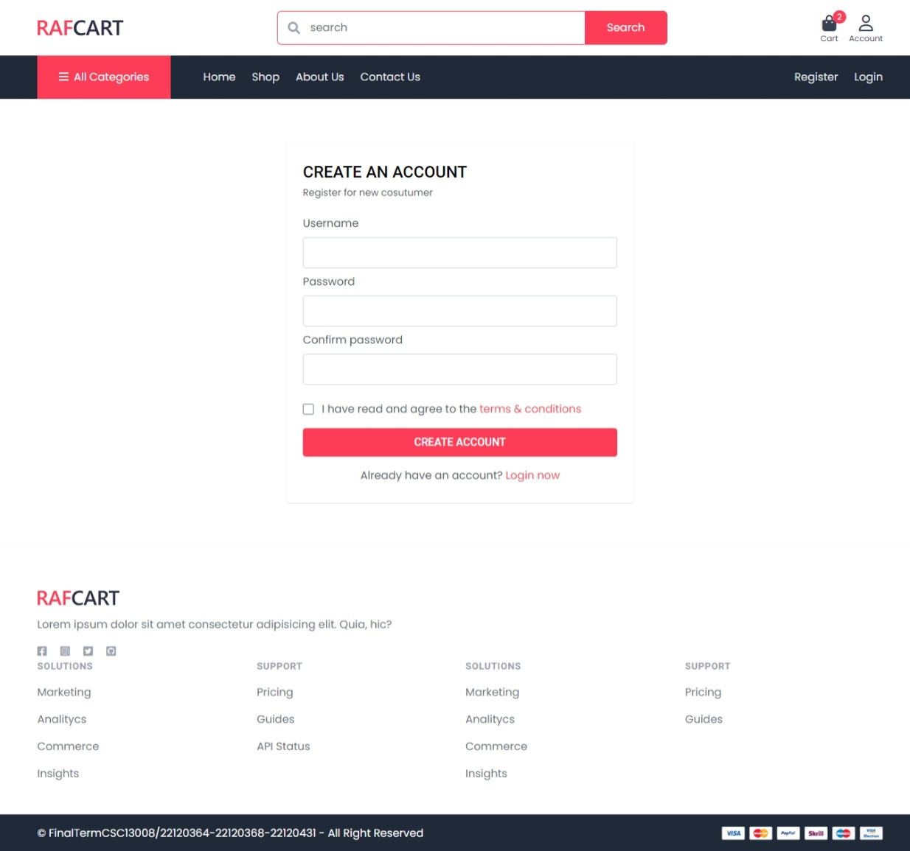
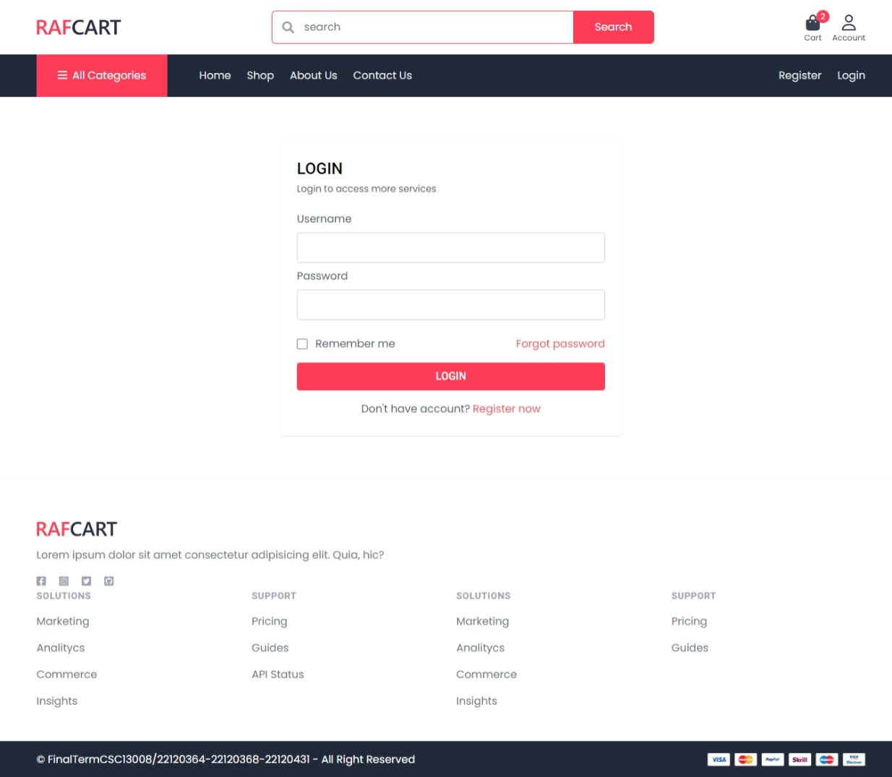
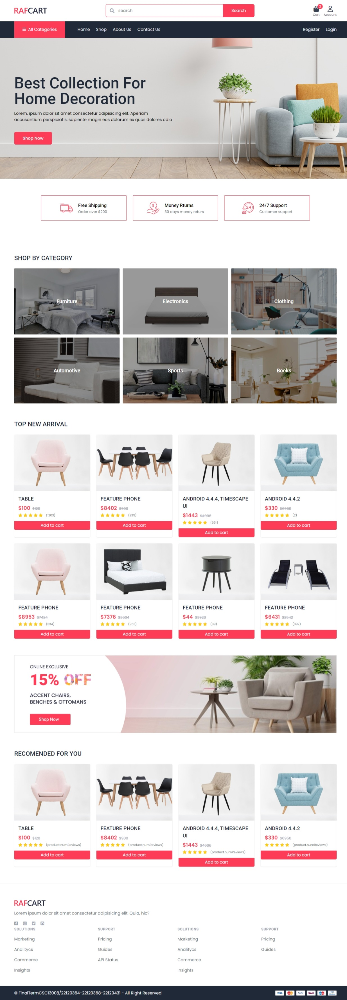
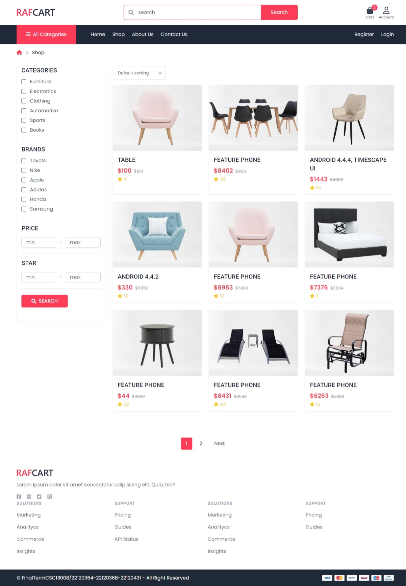
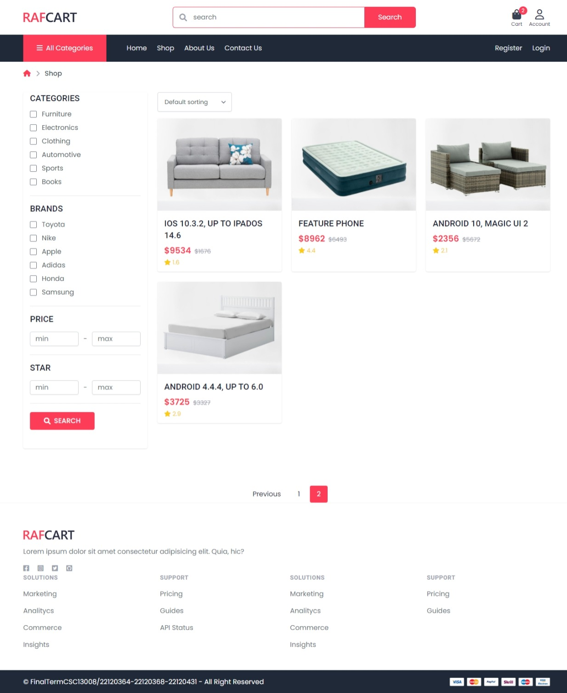
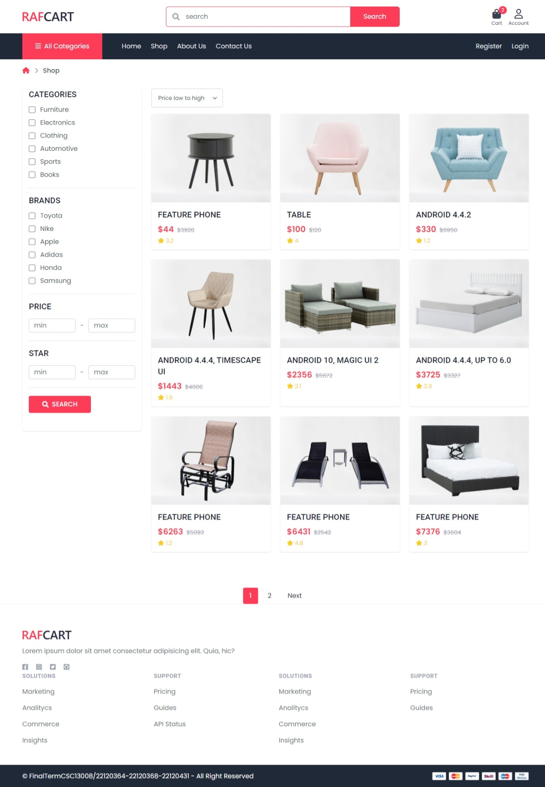
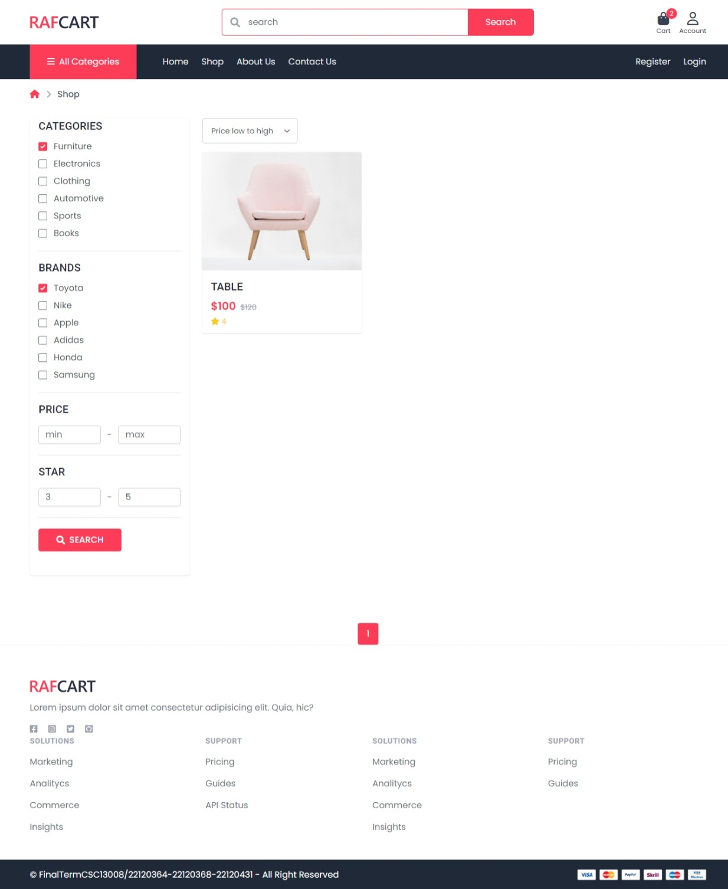
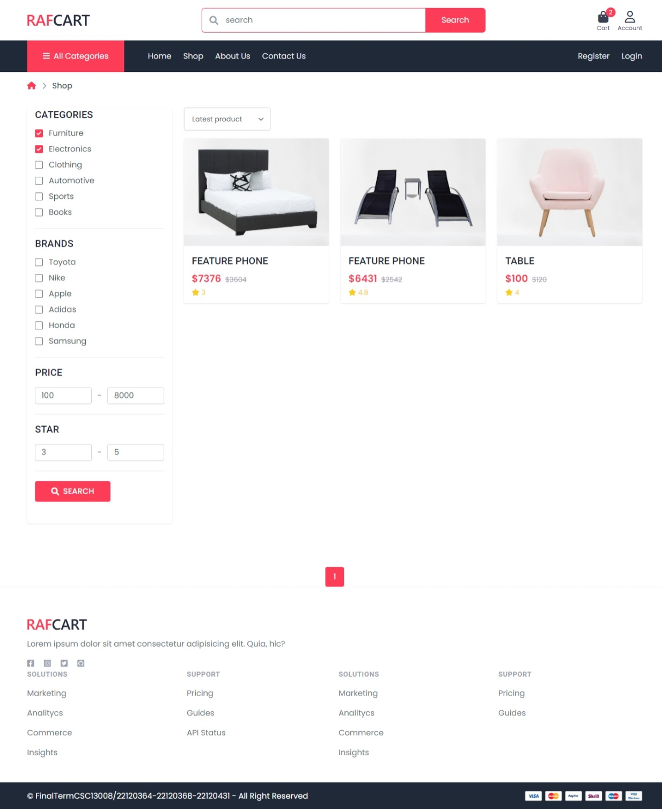

# GA03 - MVC Architecture

## Group information

| Student ID | Full name          |
| ---------- | ------------------ |
| 22120364   | Nguyễn Hoài Thương |
| 22120368   | Phan Thanh Tiến    |
| 22120441   | Nguyễn Trường Vũ   |

## Self-evaluate

### Functional
- [x] Implement search functionality for product names and descriptions: 2  points.
- [x] Combine search with filtering, allowing users to filter based on at least four attributes: 2 points.
- [x] Add a section for relevant products on each product detail page to increase user engagement: 1 point.
- [x] Design a home page featuring promotions, featured products, and other relevant elements to attract users: 1 point.
- [x] Develop a login page as part of the user authentication flow: 1 point.
- [x] Host the project publicly to allow external access and testing: 1 point.
**=> Self-evaluated score: 8/8**

## Hosted page

https://shop-ssr.onrender.com/

> [!WARNING]  
> The free host will spin down if there are no activities, which can delay request by a few minutes.

> [!WARNING]  
> The free-tier database may also have limited resources, which can cause slow response time, and may be deleted after a period of inactivity.

## ORM

- ORM: Prisma
- Database: PostgreSQL

## Screenshots

- Register page:

- Login page:

- Home page:

- Product page with filter, sort and paging:

- Sort, filter:

