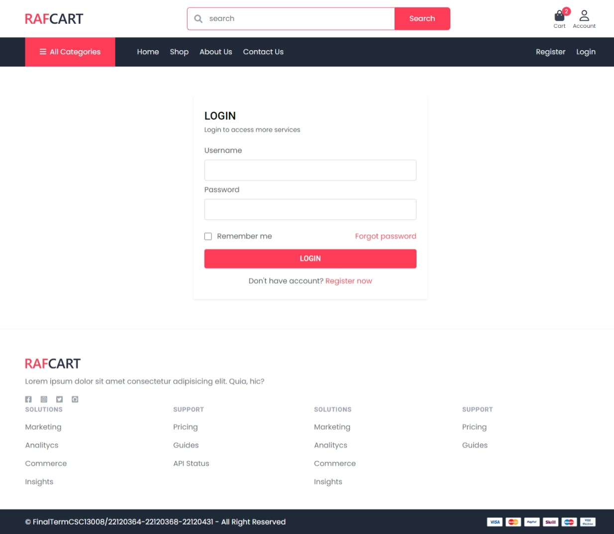
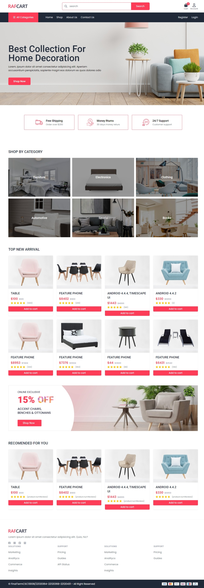
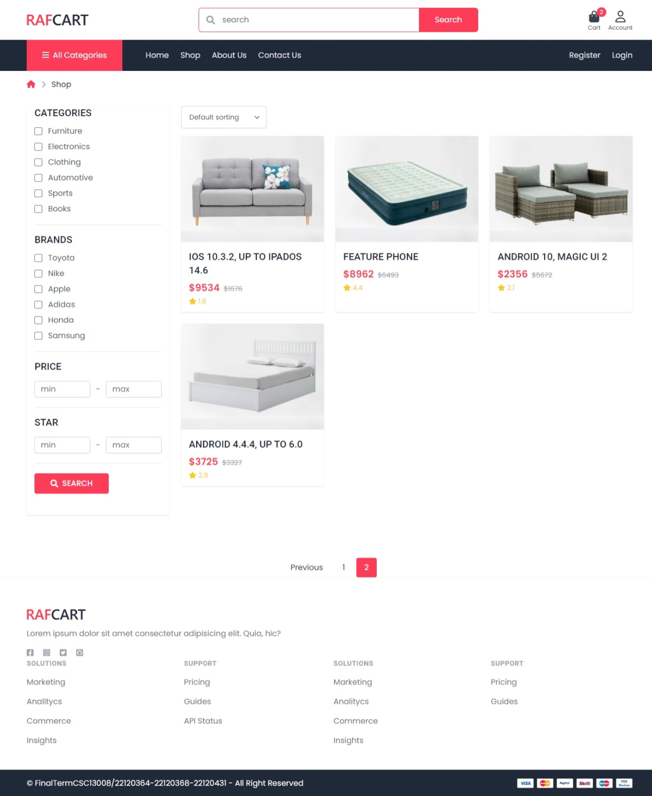
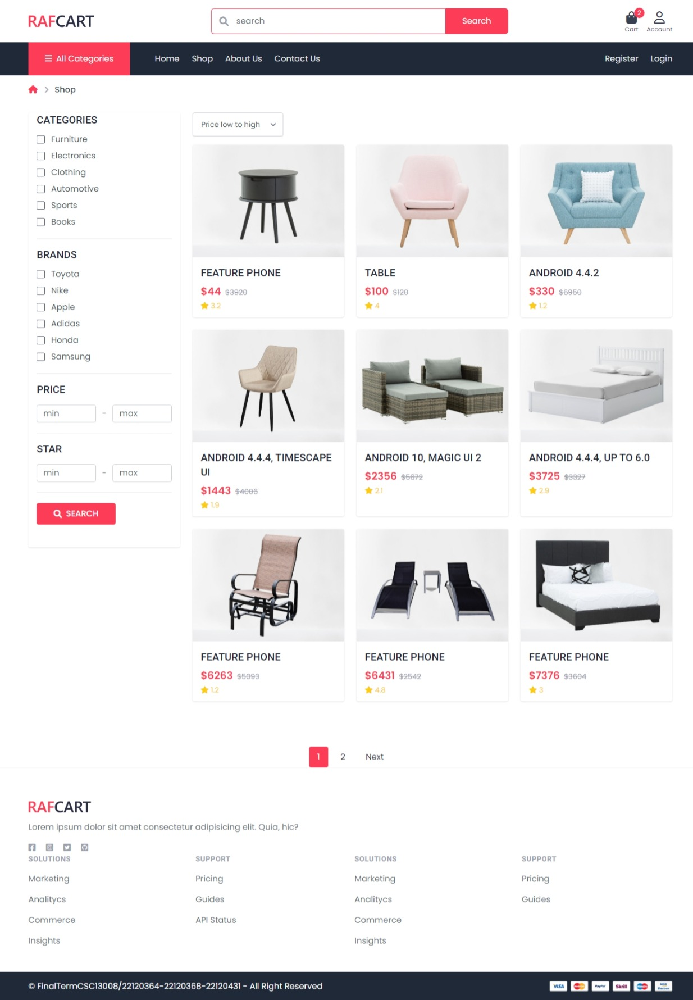
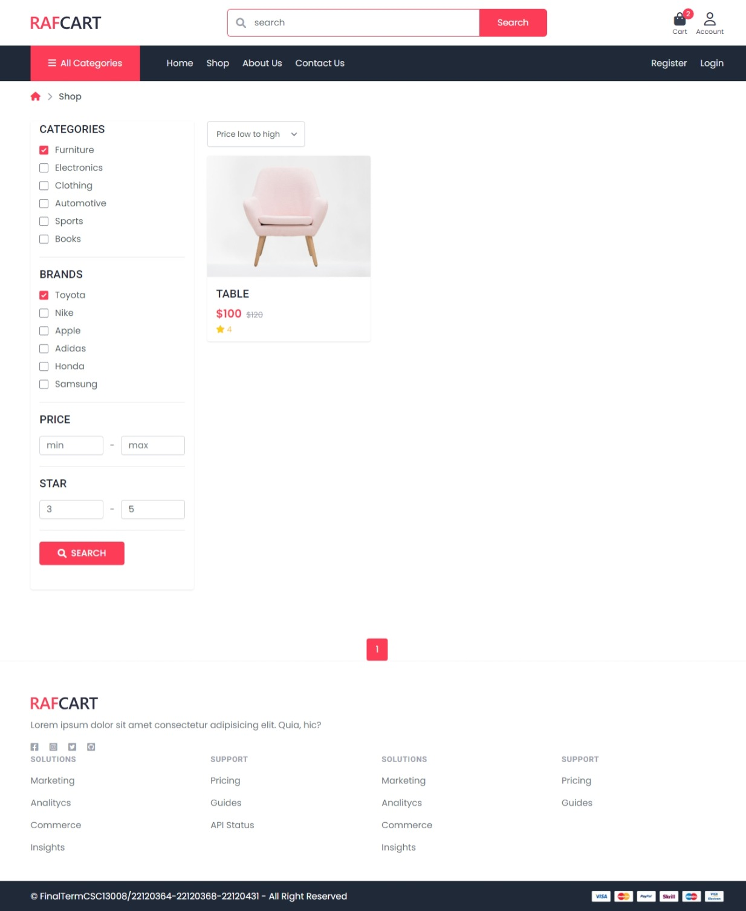

# GA06 - Authentication

## Group information

| Student ID | Full name          |
| ---------- | ------------------ |
| 22120364   | Nguyễn Hoài Thương |
| 22120368   | Phan Thanh Tiến    |
| 22120441   | Nguyễn Trường Vũ   |

## Self-evaluate

### Functional

#### Passport Configuration (3 pts)

- [x] Configured `passport.js` for authentication.
- [x] Used `local` strategy for email/password authentication.
- [x] Session management is implemented using `express-session`.

#### User registration and login (2 pts)

- [x] Registration route implemented with proper validation (backend + frontend validation)
- [x] Password hashed using `bcryptjs`.
- [x] Login route authenticates users with valid credentials.
- [x] Incorrect login attempts are handled gracefully (denied - show error to user).

#### Protected route (2 pts)

- [ ] Design a home page featuring promotions, featured products, and other relevant elements to attract users: 1 point.
- [ ] Develop a login page as part of the user authentication flow: 1 point.

#### Log out functionality (2 pts)

- [x] The logout route ends the user session.
- [x] After logging out, users cannot access protected routes.

#### Website publishing (1 pt)

- [x] Host the project publicly to allow external access and testing.

#### ==> Self-evaluated score: 10

## Hosted page

https://shop-ssr.onrender.com/

> [!WARNING]  
> The free host will spin down if there are no activities, which can delay request by a few minutes.

> [!WARNING]  
> The free-tier database may also have limited resources, which can cause slow response time, and may be deleted after a period of inactivity.

## ORM

- ORM: Prisma
- Database: PostgreSQL

## Screenshots

- Register page:

- Login page:

- Home page:

- Product page with filter, sort and paging:

- Sort, filter:

