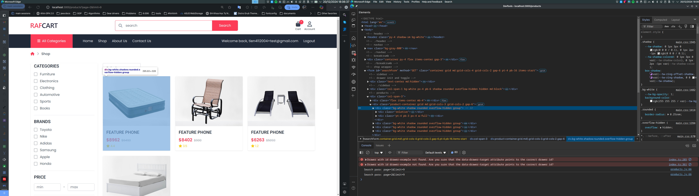
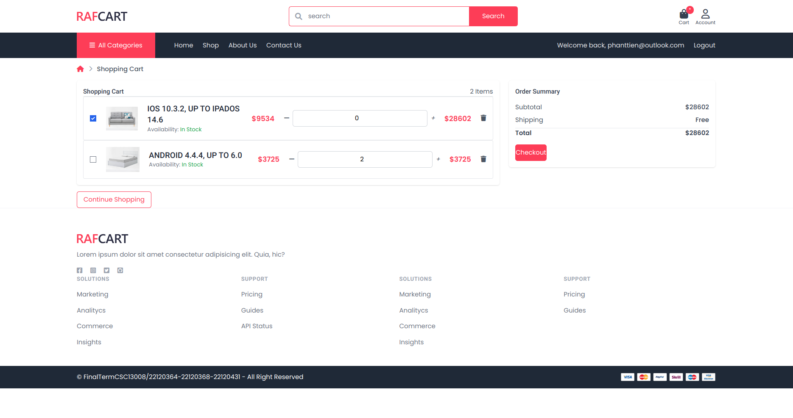
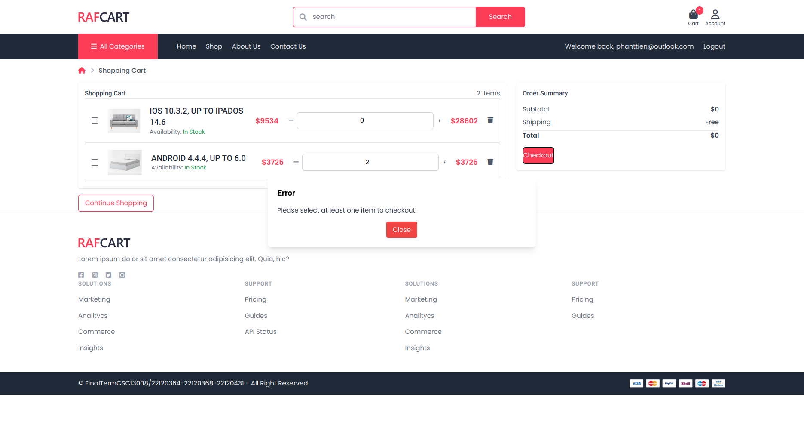
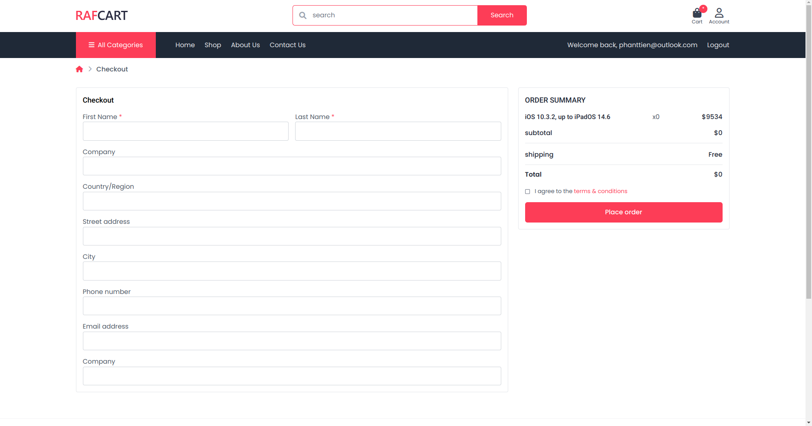

# GA06 - Authentication

## Group information

| Student ID | Full name          |
| ---------- | ------------------ |
| 22120364   | Nguyễn Hoài Thương |
| 22120368   | Phan Thanh Tiến    |
| 22120441   | Nguyễn Trường Vũ   |

## Self-evaluate

### Functions

- [x] Proper folder structure and naming conventions: 1 point
- [x] Add product to cart functionality works correctly: 1 point
- [x] The shopping cart page shows added items with a total price: 2 points
- [x] Update product quantity in cart works correctly: 1 point
- [x] Remove product from cart works correctly: 1 point
- [x] Checkout moves items from cart to order: 2 points
- [x] Clean and user-friendly UI: 1 point
- [x] Publish to public host: 1 point

#### ==> Self-evaluated score: 10

- We are using `anchor` for adding product to cart, `button` for updating quantity and removing product from cart, and `form` for checkout.

## Note

> [!CAUTION] Caution
> After running database migrations, you need to run this SQL query to create the session table for the session management:

```sql
CREATE TABLE "session" (
  "sid" varchar NOT NULL COLLATE "default",
  "sess" json NOT NULL,
  "expire" timestamp(6) NOT NULL
)
WITH (OIDS=FALSE);

ALTER TABLE "session"
ADD CONSTRAINT "session_pkey"
PRIMARY KEY ("sid")
NOT DEFERRABLE INITIALLY IMMEDIATE;

CREATE INDEX "IDX_session_expire" ON "session" ("expire");
```

## Hosted page

https://shop-ssr-tu6z.onrender.com

> [!WARNING]  
> The free host will spin down if there are no activities, which can delay request by a few minutes.

> [!WARNING]  
> The free-tier database may also have limited resources, which can cause slow response time, and may be deleted after a period of inactivity.

## Screenshots








